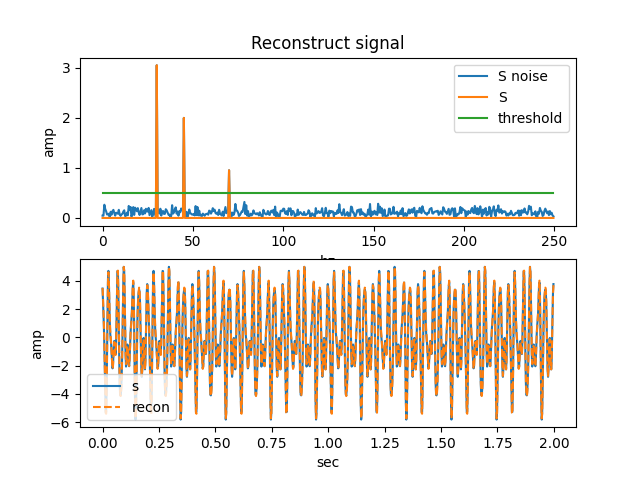
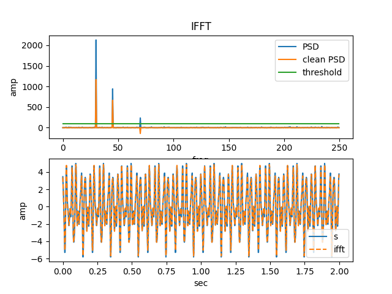

# Fast Fouier Transform
FFT is an algoithm that compute the discrete Fourier Transform in an O(nlogn) time instead of O(n^2).

FFT allows a signal in time domain to be mapped into frequency domain to easily see the hz components of the signal and its amplitude

# Discrete Fourier Transform
is defined to be
$$
X_k = \sum_{j=0}^{N-1} x_j * e^{-i2\pi jk/N}
$$

$$w_n = e^{-i2\pi/N}$$

$$i = \sqrt{-1}$$

When k = 0 (first row)with j = 0 to N-1, the exponent is always equal to 0, therefore 

$$ X_k = \sum_{j=0}^{N-1} x_j $$

which is the summation of all the DC components.

When k = 1 (second row) with j = 0 to N-1, the exponent is equal to 

$$ e^{-i2\pi 0*1/N} = 1$$

$$ e^{-i2\pi 1*1/N} =  w_n$$

$$ e^{-i2\pi 2*1/N} =  w_n^2$$

$$ e^{-i2\pi 3*1/N} =  w_n^3$$

$$...$$

$$ e^{-i2\pi (N-1)*1/N} =  w_n^{N-1}$$

# Inverse Discrete Fourier Transform
is defined to be
$$
x_k = \frac{1}{N} \sum_{j=0}^{N-1} X_j * e^{i2\pi jk/N}
$$

# Signal with Noise
Signal 1 with amplitude 3, frequency 30 hz, and phase shift 0.6.
Signal 2 with amplitude 2, frequency 45 hz, and phase shift -0.8.
Signal 3 with amplitude 1, frequency 70 hz, and phase shift 2.
Added a random normal distribution of noise to my total signal.

Can see that the clean signal s is being covered with noise. In time domain, it hard to determine how much of the signal is noise and how of much is the real signal. After taking the FFT, can easily see 3 main signals with noise all along the entire frequency spectrum.

Using a threshold of 0.5 amplitude, all signals below this are zeroed out to give a pure signal of S. Using the 3 main peaks of frequency domain, can find/calculate the amplitude, frequency, and phase shift to reconstruct the signal without noise.

Using a threshold of 0.5 amplitude, can use IFFT to get the pure signal back out. (need fixing)

# References
[Matlab FFT](https://www.youtube.com/watch?v=XEbV7WfoOSE)
